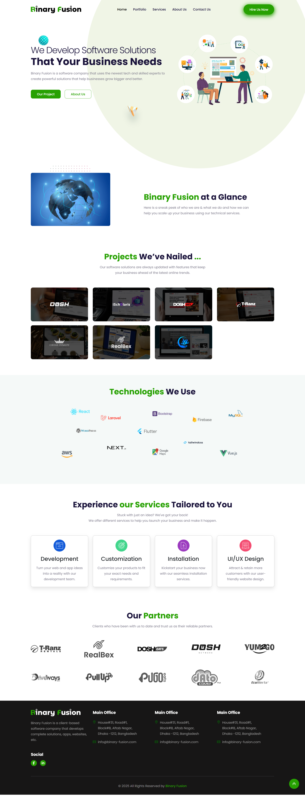

# 🌐 Company Website Clone Project

This project is a **clone of a company website**, created for learning, practice, and portfolio purposes.  
It replicates the layout, sections, and design of an existing corporate website, giving a hands-on experience of building a real-world website from scratch.

---

## Preview

---

## 📝 Project Overview

- Fully responsive **company website clone**.  
- Includes **Hero Section**, **About**, **Services**, **Portfolio**, **Contact**, and **Footer** sections.  
- Implements modern **HTML5, CSS3, and Bootstrap** techniques.  
- Uses **AOS (Animate On Scroll)** for scroll-based animations.  
- Clean and organized code structure for learning and customization.  

---

## 🧱 Tech Stack

- **HTML5** – Markup structure  
- **CSS3** – Styling, responsive design, custom variables  
- **Bootstrap 5** – Grid system and layout  
- **AOS (Animate On Scroll)** – Animations  
- **JavaScript** – Optional for interactivity  
- **PHP** – Optional for interactivity  

---

## Installation & Usage

1. Clone the repository: `git clone https://github.com/sumonprodhan-dev/binary-fashion-website-clone.git`

2. Navigate to the project folder: `cd binary-fashion-website-clone`

3. Open the project in your browser:  
   - Double-click `index.html`  
   - Or right-click → Open With → Your preferred browser

4. Optional: Run a local server (if using fetch/includes or PHP):  
   - Run `npx http-server .`  
   - Open `http://localhost` in your browser

### Thank you [Sumon Prodhan](https://sumonprodev.wixsite.com/sumonprodhan)